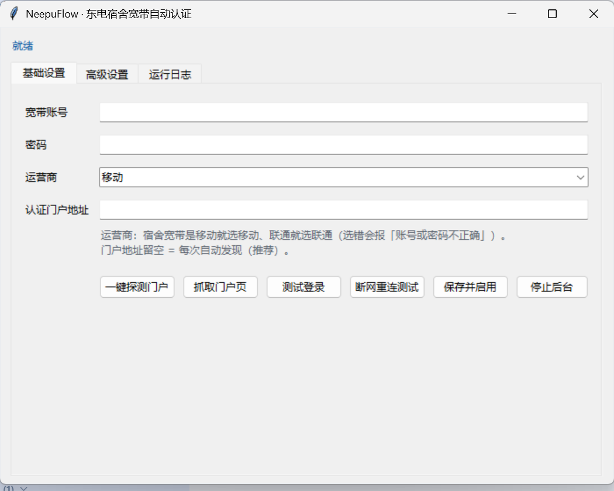

# NeepuFlow

> 东北电力大学宿舍宽带（`NEEPU-STU`）自动认证工具 —— 连上 Wi-Fi 自动帮你登录，不用每次开浏览器点认证页。


---

## 目录

- [为什么需要它](#为什么需要它)
- [特性](#特性)
- [界面](#界面)
- [快速开始](#快速开始)
- [它是怎么工作的](#它是怎么工作的)
- [命令行](#命令行)
- [常见问题](#常见问题)
- [项目结构](#项目结构)
- [免责声明](#免责声明)
- [许可证](#许可证)

---

## 为什么需要它

宿舍宽带走的是网页认证（captive portal）：每天早上开机，Wi-Fi 图标显示已连接，但**打不开任何网页**，得手动打开浏览器、等认证页弹出来、输账号密码、点登录。

这个工具就是替你做这件事：**开机自动登录，界面都不用开。**

## 特性

| 特性 | 说明 |
|---|---|
| 🔌 **零第三方依赖** | 纯 Python 标准库。不用 `pip install` 任何东西，也不需要联网装包 |
| 🔐 **密码本机加密** | 用 Windows DPAPI 加密保存。换台电脑解不开，也不会明文落盘 |
| 🚀 **开机自启** | 走「启动文件夹」，不写注册表、不装系统服务、不需要管理员权限 |
| 🪶 **几乎不占资源** | 后台常驻约 **38 MB 内存，空闲 CPU 0%** |
| 🧠 **会自己判断该不该动手** | 不在目标 Wi-Fi、或者本来就已联网，它都不会乱试 |
| 🔍 **可自检** | 一条命令把加密、凭据、联网、门户、自启全查一遍 |

## 界面



## 快速开始

### 1. 装 Python（只做一次）

到 <https://www.python.org/downloads/> 下载安装 Python 3。

> ⚠️ **安装时务必勾选 `Add python.exe to PATH`**，否则程序找不到 Python。

装完不用管别的 —— 程序会自动找到你机器上版本最新的那个 Python。

### 2. 启动

把整个文件夹解压到**任意位置**（别放 `C:\Program Files` 这类需要管理员权限的目录），然后双击：

- **`启动.vbs`** —— 推荐，不弹黑框
- `启动.bat` —— 备用

### 3. 填三样东西

| 字段 | 填什么 |
|---|---|
| 宽带账号 / 密码 | 运营商给你的那个（**不是学号**） |
| 运营商 | 装的是移动就选 `移动`，联通就选 `联通` |
| 认证门户地址 | **留空**（程序自己找） |

然后点 **`保存并启用`**，再勾上 **`开机自启动`**。完事。

> ⚠️ **运营商选错一定失败**，而且报的错是「账号或密码不正确」—— 极具误导性。遇到明明密码没错却报密码错，先怀疑这里。

### 4. 立刻验证它有没有用

点 **`断网重连测试`**：它先把你强制下线，再让程序自动认证回来（几秒）。

这是唯一能马上证明有效的办法 —— 因为「连了 Wi-Fi 但没登录」这个状态平时只在开机那一下出现。

界面右上角会实时显示 `当前网络：xxx ｜ 目标：NEEPU-STU ✓/✗`。

## 它是怎么工作的

宿舍宽带的认证网关是 **Panabit**，认证门户是纯 JS 单页应用（`raasportal`）——**页面里根本没有 `<form>`**。所以「抓表单然后 POST」的传统做法对它完全无效。

程序直接调门户自己的 JSON 接口，流程是：

```
api/setacct.php  →  api/login.php  →  api/ack_auth.php  →  轮询 api/stat.php
```

密码也不是明文提交的，要先过门户的 `encode()`：**随机盐 + AES-128-ECB 零填充**。

完整的技术细节（怎么定位接口、怎么还原被混淆的加密函数、怎么逐字节验证）写在 **[技术原理.md](技术原理.md)**。

## 命令行

在文件夹里按住 `Shift` 右键 → 「在此处打开 PowerShell 窗口」，然后：

| 命令 | 作用 |
|---|---|
| `python neepu_flow.py` | 打开设置界面 |
| `python neepu_flow.py --selftest` | **自检**：加密 / 凭据 / 联网 / 门户 / 自启 全查一遍 |
| `python neepu_flow.py --probe` | 只看当前网络状态和捞到的门户参数 |
| `python neepu_flow.py --login` | 立刻做一次真实认证，并把结果打出来 |
| `python neepu_flow.py --daemon` | 后台静默运行（开机自启用的就是这个） |

出问题**先看 `neepu_flow.log`**，每一步都记了。

## 常见问题

| 现象 | 原因 |
|---|---|
| 「不在目标网络：当前连的是「xxx」」 | 连的不是 `NEEPU-STU` |
| 「网络已在线，无需认证」 | 已经登录了，无需处理 |
| 「认证被拒（ret=4）」 | 账号密码错，**或者运营商选错了**（最常见） |
| 「连不上认证网关」 | 不在校园网里 |
| 双击启动器报 `800A03F2` | 启动器编码被编辑器改坏了，用仓库里的原始文件 |
| 双击后弹微软商店 | 装 Python 时没勾 `Add to PATH`，系统找的是商店占位程序 |
| 开机后没反应 | 看启动文件夹里有没有 `NeepuFlow.vbs`；**挪过文件夹就得重新勾一次** |

## 项目结构

```
NeepuFlow/
├── neepu_flow.py        主程序（界面 + 后台 + 加密，单文件）
├── 启动.vbs             启动器（无黑框，推荐）
├── 启动.bat             启动器（备用，能看到报错）
├── config.example.json  空白配置模板（参考用）
├── 技术原理.md          认证流程与加密还原的完整说明
├── CHANGELOG.md         更新记录
├── LICENSE              MIT 许可证
└── screenshot.png       界面截图
```

首次运行后会额外生成：

| 文件 | 内容 |
|---|---|
| `config.json` | **你的账号和加密后的密码** —— 分享程序时**千万不要带上这个文件** |
| `neepu_flow.log` | 运行日志（同样含账号、内网 IP） |
| `dump/` | 排查时自动存的门户页面 |

## 免责声明

- 本工具**只帮你自动填写你自己账号的登录**。不破解、不绕过计费、不共享账号、不批量刷号。
- 请遵守学校与运营商的使用规定（学校曾明确**严禁私接路由器**共享上网）。**请仅在你自己的电脑上登录你自己的账号。**
- `config.json` 里有你的账号和电脑的 MAC、内网 IP。**分享程序时不要带上它**，`neepu_flow.log` 同理。
- 认证接口与加密方式是针对 Panabit 门户的**兼容实现**，随门户升级可能失效。失效时删掉本工具、用浏览器登录即可，**不会影响你的宽带账号**。
- 作者不对因使用本工具导致的账号异常、断网或其它后果负责。

## 许可证

[MIT](LICENSE)
